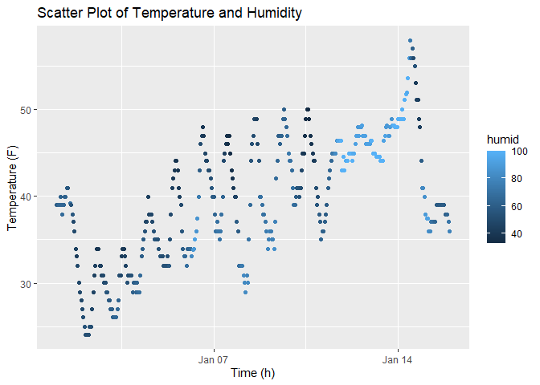

p8105_hw1_zz3167.Rmd
================
Zhiyi Zhu
2023-09-18

## Problem 1

#### Load the package

``` r
library(moderndive)
library(tidyverse)
```

#### Load the `early_january_weather` dataset

``` r
data("early_january_weather")
```

#### Description of the “early_january_weather” dataset

Below we describe the dataset including names / values of important
variables, the size of the dataset, and the mean temperature:

- The variable names of the early_january_weather dataset are origin,
  year, month, day, hour, temp, dewp, humid, wind_dir, wind_speed,
  wind_gust, precip, pressure, visib, time_hour.

- There are 358 observations and 15 variables in this dataset.

- The means temperature is 39.58.

#### Make a scatterplot of `temp` (y) vs `time_hour` (x)

``` r
ggplot(early_january_weather, aes(x = time_hour, y = temp, colour = humid)) + geom_point() + labs(x = 'Time (h)', y = 'Temperature (F)', title = 'Scatter Plot of Temperature and Humidity')
```

<!-- -->

#### Describe the patterns that are apparent in this plot

- Overall, with the increase of time, the temperature shows an
  increasing trend.
- Specific to a single day, the temperature is highest at noon and
  lowest at night.
- Specific to a single day, humidity decreases as the temperature rises.

#### Export the scatterplot to the project directory using ggsave

``` r
ggsave("time_temp_scatter.png")
```
